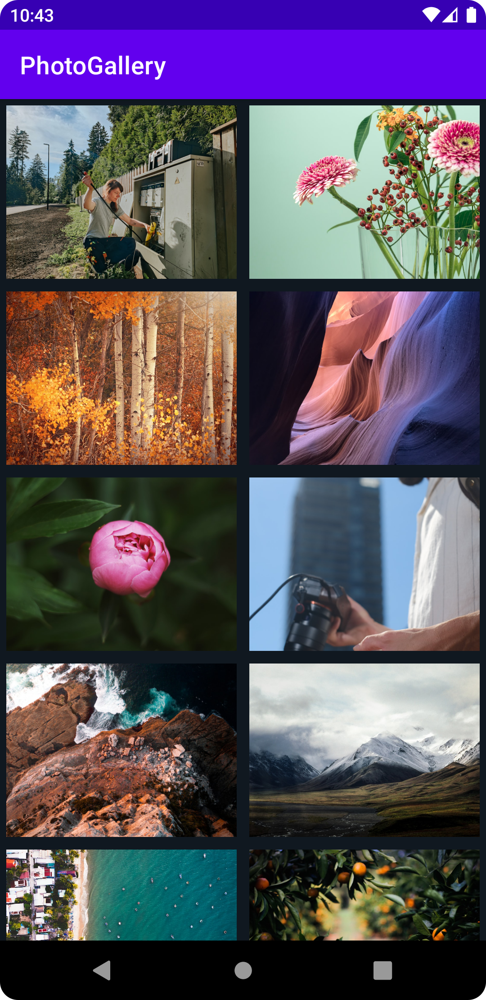

# PhotoGallery

## Screenshots

    
    
    

## Contributing

Pull requests are welcome. For major changes, please open an issue first to discuss what you would like to change.

## License

[Apache License 2.0](https://choosealicense.com/licenses/apache-2.0/)