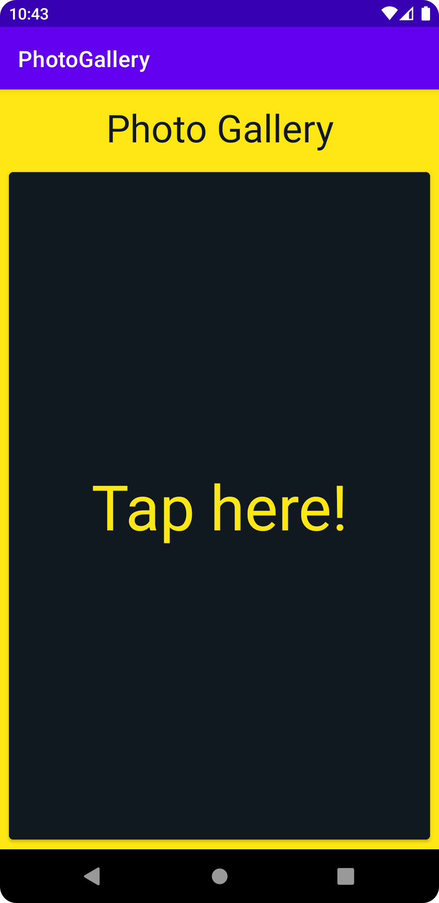

# Photo Gallery

[](https://www.codefactor.io/repository/github/hier631/photogallery)
[](https://codeclimate.com/github/Hier631/PhotoGallery/maintainability)
[](https://choosealicense.com/licenses/apache-2.0/)

Photo Gallery is a demo application that shows how to create an image gallery using the Unsplash REST API.

## Motivation

I created this application because I wanted to learn how to connect to a REST API using Retrofit
and then show its response using data binding inside an Android application.

## Screenshots

<p align="center">
    
    
    
</p>

## How to compile

Before compiling the application, you should edit the ACCESS_KEY variable found inside the
MainActivity class and add your own Unsplash Access Key.

```java
public static String ACCESS_KEY = "";
```

To get an Unsplash Access Key, you must first register a new application within your Unsplash
user account. For more information, visit the following link:

<https://unsplash.com/documentation#registering-your-application>

## Contributing

Pull requests are welcome. For major changes, please open an issue first to discuss what you would like to change.

## License

[Apache License 2.0](https://choosealicense.com/licenses/apache-2.0/)